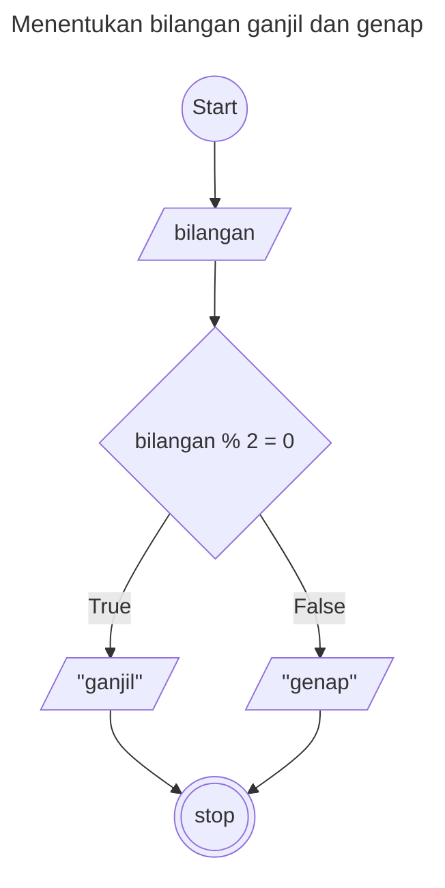

# Flowchart untuk program menentukan bilangan ganjil dan genap

```mermaid
---
    title: Menentukan bilangan ganjil dan genap
---
flowchart TD
    id1((Start))
    id2[/bilangan/]
    id1 --> id2
    id3{bilangan % 2 = 0}
    id2 --> id3
    id4[/''ganjil''/]
    id5[/''genap''/]
    id6(((stop)))
    id3 -- True --> id4 --> id6
    id3 -- False --> id5 --> id6
```