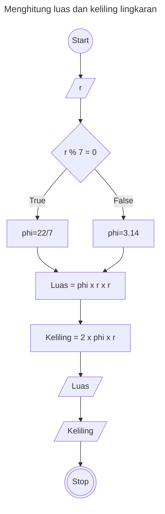

# Flowchart untuk program menghitung luas dan keliling lingkaran

```mermaid
---
    title: Menghitung luas dan keliling lingkaran
---
flowchart TD
    id1((Start))
    id2[/r/]
    id1 --> id2
    id3{r % 7 = 0}
    id2 --> id3
    id4[phi=22/7]
    id5[phi=3.14]
    id3 -- True --> id4
    id3 -- False --> id5
    id6[Luas = phi x r x r]
    id7[Keliling = 2 x phi x r]
    id4 & id5 --> id6
    id6 --> id7
    id8[/Luas/]
    id9[/Keliling/]
    id7 --> id8
    id8 --> id9
    id10(((Stop)))
    id9 --> id10
    
```