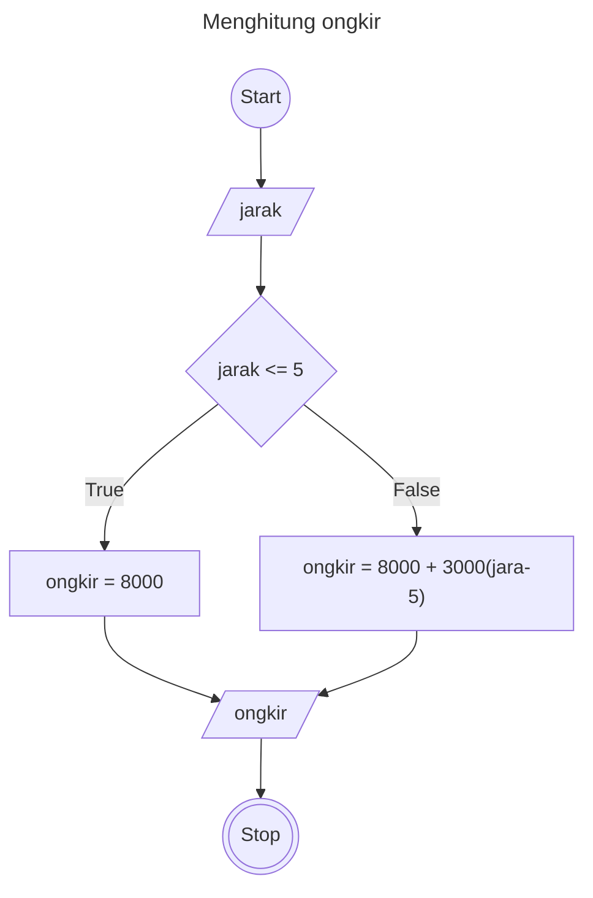

# Flowchart untuk program menghitung ongkir

```mermaid
---
    title: Menghitung ongkir
---
flowchart TD
    id1((Start))
    id2[/jarak/]
    id1 --> id2
    id3{jarak <= 5}
    id2 --> id3
    id4[ongkir = 8000]
    id5["ongkir = 8000 + 3000(jara-5)"]
    id3 -- True --> id4 --> id6
    id3 -- False --> id5 --> id6
    id6[/ongkir/]
    id7(((Stop)))
    id6 --> id7
    
```