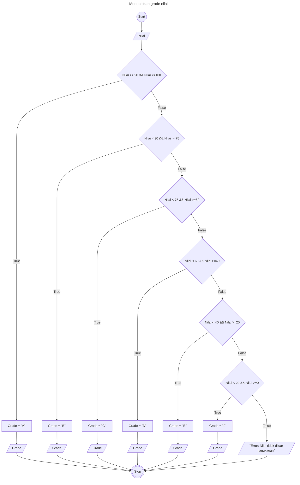

# Flowchart untuk program menentukan grade nilai

```mermaid
---
    title: Menentukan grade nilai
---
flowchart TD
    id1((Start))
    id2[/Nilai/]
    id1 --> id2
    id3{Nilai >= 90 && Nilai <=100}
    id4{Nilai < 90 && Nilai >=75}
    id5{Nilai < 75 && Nilai >=60}
    id6{Nilai < 60 && Nilai >=40}
    id7{Nilai < 40 && Nilai >=20}
    id8{Nilai < 20 && Nilai >=0}
    id2 --> id3
    id3 -- False --> id4
    id4 -- False --> id5
    id5 -- False --> id6
    id6 -- False --> id7
    id7 -- False --> id8
    id8 -- False --> id9[/''Error: Nilai tidak diluar jangkauan''/]
    id3 -- True --> id10[Grade = ''A''] --> id11[/Grade/] --> id22
    id4 -- True --> id12[Grade = ''B''] --> id13[/Grade/] --> id22
    id5 -- True --> id14[Grade = ''C''] --> id15[/Grade/] --> id22
    id6 -- True --> id16[Grade = ''D''] --> id17[/Grade/] --> id22
    id7 -- True --> id18[Grade = ''E''] --> id19[/Grade/] --> id22
    id8 -- True --> id20[Grade = ''F'] --> id21[/Grade/] --> id22
    id9 --> id22
    id22(((Stop)))
    
```